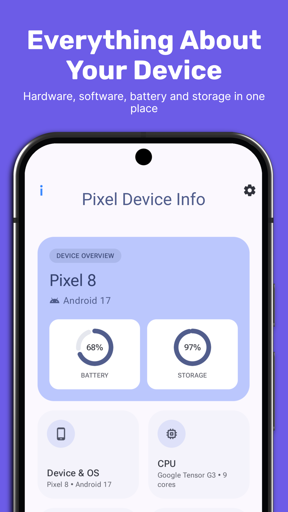

<p align="center">
  
</p>

<h1 align="center">Pixel Device Info</h1>

<p align="center">
  A modern device information app for Android, built with Material 3 Expressive to feel at home
  alongside Google's own Pixel apps. Everything it reads stays on your device: no accounts, no internet permission, no analytics.
</p>

<p align="center">
  <a href="https://github.com/wwwescape/pixel-device-info/releases"></a>
  <a href="https://github.com/wwwescape/pixel-device-info/commits/master"></a>
  <a href="https://github.com/wwwescape/pixel-device-info"></a>
</p>

## Screenshots

<div>
  
  
  
  <hr width=91%>
  
  
</div>

## Features

- **Dashboard** — a clean overview of your device on a single screen.
- **Detail pages** — Device & OS, CPU, Memory & Storage, Battery & Thermal, Display, Network,
  Sensors, and Camera, with live-updating metrics and history charts.
- **Home screen widget** — device name, Android version, battery level, and storage usage,
  with its own Light, Dark, or System theme.
- **Personalization** — Celsius/Fahrenheit, a refresh interval (Battery Saver, Normal, or
  Fast), and per-widget themes.
- **Material 3 Expressive design** — light, dark, and system themes, dynamic color (Material
  You), 16+ curated color themes, adjustable contrast, and Pure Black / Absolute Black modes.
- **Languages** — English, Spanish, French, Hindi, and Portuguese.
- **Light on battery** — sensors and live stats run only while the app is on screen.

## Installation

Download the APK from the [latest release](https://github.com/wwwescape/pixel-device-info/releases/latest)
and install it on your device.

Requires Android 7.0 (API 24) or newer.

## Privacy

Pixel Device Info collects nothing. It has no internet permission, no accounts, no analytics, and no
crash-reporting SDKs.

Location, Phone, and Bluetooth permissions are requested only when you choose to grant them on the
**Network** screen, and are used only to show that information back to you. See the in-app Privacy Policy
(**Settings → About**) for the full breakdown.

## Development

### Prerequisites

- [Android Studio](https://developer.android.com/studio) (Narwhal or newer)
- JDK 17+ (bundled with Android Studio)
- An Android device or emulator running Android 7.0 (API 24) or newer

### Build & run

```bash
git clone https://github.com/wwwescape/pixel-device-info.git
cd pixel-device-info
./gradlew installDebug
```

Or open the project in Android Studio and run the `app` configuration.

### Test

```bash
./gradlew lint testDebugUnitTest connectedDebugAndroidTest
```

`connectedDebugAndroidTest` needs a connected device or a running emulator.

### Release a new version

Bump `versionCode` and `versionName` in `app/build.gradle.kts`, commit, then:

```bash
git tag v0.1.0
git push origin v0.1.0
```

The tag push builds a signed release APK and AAB and attaches them to a new GitHub Release (see
`.github/workflows/release.yml`). It needs the `KEYSTORE_BASE64`, `KEYSTORE_PASSWORD`,
`KEY_ALIAS`, and `KEY_PASSWORD` repository secrets, which are kept locally in the gitignored
`keystore.properties`.

### Project layout

```
app/       Kotlin, Jetpack Compose (Material 3), Glance (widget), single module
scripts/   generate_device_names.py — rebuilds the model-to-marketing-name list from Google Play
design/    Source logo and Play Store icon assets
assets/    README assets and screenshots
```

## License

GPL-3.0 — see [LICENSE](LICENSE).

## Support

If you find Pixel Device Info useful, consider buying me a coffee:

[](https://buymeacoffee.com/wwwescape)
